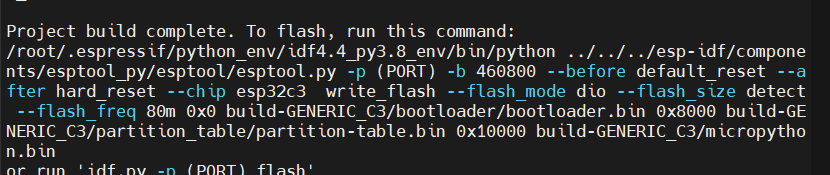

<main class="wp-block-group is-layout-flow wp-block-group-is-layout-flow" id="wp--skip-link--target">

<h1 style="" class="alignwide wp-block-post-title">mpy固件编译成功</h1>

<h5 class="wp-block-heading">前情提要：ubuntu 20.04 ltsc，vps（解决网络问题)</h5>

<strong>具体流程</strong>

更新源列表

<pre class="wp-block-code"><code>sudo apt-get update
sudo apt-get upgrade  #Optional</code></pre>

<strong>python配置</strong>        将默认python版本改为python3

 查看当前系统默认python版本

<pre class="wp-block-code"><code>python --version</code></pre>

查看python3

<pre class="wp-block-code"><code>whereis python3</code></pre>

删除原有python2的软连接

<pre class="wp-block-code"><code>sudo rm /usr/bin/python</code></pre>

新建python3的软连接

<pre class="wp-block-code"><code>sudo ln -s /usr/bin/python3.8 /usr/bin/python</code></pre>

安装pip

<pre class="wp-block-code"><code>apt install python3-pip
</code></pre>

安装virtualenv！！

<pre class="wp-block-code"><code>pip install virtualenv</code></pre>

<strong>安装必备软件</strong>

Git：

<pre class="wp-block-code"><code>sudo apt-get install git</code></pre>

资源库中，有一个名为 build-essential 的包，它包含 GCC 和其他各种编译器，如 g++ 和 make来安装：

<pre class="wp-block-code"><code>sudo apt update
sudo apt install build-essential</code></pre>

cmake:

<pre class="wp-block-code"><code>apt-get install cmake</code></pre>

<h6 class="wp-block-heading">基于arm内核编译的工具链：(可选的）</h6>
<pre class="wp-block-code"><code>sudo apt-get install gcc-arm-none-eabi</code></pre>

<strong>Git克隆</strong> #网络环境 esp-idf克隆：注意 esp-idf版本！！

<pre class="wp-block-code"><code>git clone -b v5.0.2 --recursive https://github.com/espressif/esp-idf.git</code></pre>

若esp-idf已经存在，请更新模块

<pre class="wp-block-code"><code>cd esp-idf
git checkout v5.0.2
git submodule update --init --recursive</code></pre>
<h6 class="wp-block-heading">micropython源码克隆： </h6>
<pre class="wp-block-code"><code>git clone -b v1.21.0 --recursive https://github.com/micropython/micropython.git</code></pre>

<strong>micropython固件编译的安装</strong>

<h6 class="wp-block-heading">ESP-IDF 配置好编译环境</h6>
<pre class="wp-block-code"><code>cd esp-idf
./install.sh
source export.sh</code></pre>
<h6 class="wp-block-heading">编译 MicroPython</h6>

必须先构建 MicroPython 交叉编译器，这将用于 预编译（冻结）内置 Python 代码。这个交叉编译器是构建的，并且 使用以下命令在主机上运行：

<pre class="wp-block-code"><code>make -C mpy-cross</code></pre>
<pre class="wp-block-code"><code>cd ports/esp32
make submodules
make</code></pre>

生成的固件为：<code>firmware.bin   ..build-ESP32_GENERIC/</code>

如果是编译esp32c3，在make后缀加型号：

<pre class="wp-block-code"><code>make BOARD=GENERIC_C3</code></pre>

<h2 class="wp-block-heading" id="user-content-defining-a-custom-esp32-board"><a href="https://github.com/micropython/micropython/tree/master/ports/esp32#defining-a-custom-esp32-board">定义自定义 ESP32 开发板</a></h2>

默认的 ESP-IDF 配置设置由目录中的 board 定义提供。对于自定义配置 您可以定义自己的 Board 目录。通过以下方式开始新的电路板配置 复制现有的（如）并修改它以适合您的开发板。<code>ESP32_GENERIC</code><code>boards/ESP32_GENERIC</code><code>ESP32_GENERIC</code>

特定于 MicroPython 的配置值在特定于主板的文件中定义，该文件包含在 中。附加 设置被放入 ，包括配置 ESP-IDF 设置的文件列表。一些标准文件是 在目录中提供，例如 .您可以 此外，在 Board 目录中定义自定义的。<code>mpconfigboard.h </code><code>mpconfigport.h </code><code>mpconfigboard.cmake </code><code>sdkconfig  </code><code>boards/</code><code>boards/sdkconfig.ble</code>

如何在micropython固件中加入自己的py库

mpy的源码结构在不断更新 目前只需要找到对应的port文件夹下的modules就可以了，往里面直接扔py文件就会自动被编译到固件了 原理也不难，当前的manifest.py自动freeze了modules这个文件夹 比如esp32 就是ports\esp32\moduels

Raspberry RP2040

必须先构建 MicroPython 交叉编译器，这将用于 预编译（冻结）内置 Python 代码。这个交叉编译器是构建的，并且 使用以下命令在主机上运行：

<pre class="wp-block-code"><code>make -C mpy-cross</code></pre>

此命令应从此存储库的根目录执行。 下面的所有其他命令都应该从 ports/rp2/ 目录执行。

RP2 固件的构建完全使用 CMake 完成，尽管简单 为了方便起见，还提供了 Makefile。要构建固件，请运行（从 此目录）：

<pre class="wp-block-code"><code>make submodules
make clean
make</code></pre>

如果你使用的是Rasoberry Pi Pico以外的其他板，那么你应该 将开发板名称传递给构建;例如，对于Raspberry Pi Pico W：

<pre class="wp-block-code"><code>make BOARD=RPI_PICO_W submodules
make BOARD=RPI_PICO_W clean
make BOARD=RPI_PICO_W</code></pre>

参考资料：

[1]github.<a href="https://github.com/micropython/micropython/tree/master/ports/esp32">micropython esp32</a>

[2]github.<a href="https://github.com/micropython/micropython/tree/master/ports/rp2">micropython rp2</a>

[3]csdn,<a href="https://blog.csdn.net/jd3096/article/details/120641783">在micropython固件中加入自己的py库</a>

[4]csdn.<a href="https://zhuanlan.zhihu.com/p/153124468" data-type="URL" data-id="https://zhuanlan.zhihu.com/p/153124468" target="_blank" rel="noreferrer noopener">wsl代理</a>

<time datetime="2023-01-17T00:19:48+08:00">1月 17, 2023</time>

louis16s

<a href="http://192.168.5.111/index.php/category/test/" rel="tag">嵌入式开发</a>

</main>

<a class="wp-block-button__link wp-element-button" href="http://192.168.5.111/wp-admin" target="_blank" rel="noreferrer noopener">登录</a>

<a class="wp-block-button__link wp-element-button">RSS</a>

</footer>

